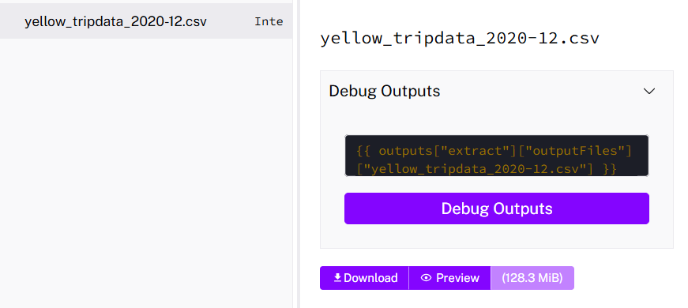

## Module 2 Homework

For the homework, we'll be working with the _green_ taxi dataset located here:

`https://github.com/DataTalksClub/nyc-tlc-data/releases/tag/green`

And _yellow_ taxi dataset located here:

`https://github.com/DataTalksClub/nyc-tlc-data/releases`

Open Docker.

Once you have Docker running using bash in VSCode:

`cd 2_workflow_orchestration/`

Create a docker-compose.yml file inside your 2-workflow-orchestration (using code of https://github.com/ManuelGuerra1987/data-engineering-zoomcamp-notes/blob/main/2_Workflow-Orchestration-(Kestra)/README.md#2-hands-on-coding-project-build-data-pipelines-with-kestra)

Create a ny_taxi_postgres_data folder in the same directory.

The directory structure now should look like this:

├── Workflow-Orchestration
    ├── flows
    |
    ├── ny_taxi_postgres_data
    |
    └── docker-compose.yaml

Navigate to Workflow-Orchestration and run the following command to start it:

`docker compose up -d`

Once the container starts, you can access the Kestra UI at http://localhost:8080. If it doesn't work, you should secure that all volumes is running in Docker (go to Docker app).

Later, you can access the pgAdmin UI at http://localhost:8090 (email/username and password is in the docker-compose.yaml)

To connect pgadmin with the postgress db: Right-click on Servers on the left sidebar --> Register--> Server

Under General give the Server a name: kestra taxi
Under Connection add:
- host name: pgdatabase
- port:5432
- user:root
- password:root

### Assignment

So far in the course, we processed data for the year 2019 and 2020. Your task is to extend the existing flows to include data for the year 2021.

As a hint, Kestra makes that process really easy:
1. You can leverage the backfill functionality in the [scheduled flow](../../../02-workflow-orchestration/flows/06_gcp_taxi_scheduled.yaml) to backfill the data for the year 2021. Just make sure to select the time period for which data exists i.e. from `2021-01-01` to `2021-07-31`. Also, make sure to do the same for both `yellow` and `green` taxi data (select the right service in the `taxi` input).
2. Alternatively, run the flow manually for each of the seven months of 2021 for both `yellow` and `green` taxi data. Challenge for you: find out how to loop over the combination of Year-Month and `taxi`-type using `ForEach` task which triggers the flow for each combination using a `Subflow` task.

### Quiz Questions

1) Within the execution for `Yellow` Taxi data for the year `2020` and month `12`: what is the uncompressed file size (i.e. the output file `yellow_tripdata_2020-12.csv` of the `extract` task)?
- **128.3 MB**
- 134.5 MB
- 364.7 MB
- 692.6 MB

Create the flow in Kestra directly. Click in +Create, and copy/paste code of 02_postgres_taxi.yaml from https://github.com/ManuelGuerra1987/data-engineering-zoomcamp-notes/blob/main/2_Workflow-Orchestration-(Kestra)/flows/02_postgres_taxi.yaml

Next, you should go to Flows. Select each Id='02_postgres_taxi.yaml', and click in Execute.

Go to Outputs. Go to Extract in Tasks. 

Check in PgAdmin. Head over to PgAdmin --> Servers --> kestra taxi --> Databases --> ny_taxi --> Schemas --> public --> Tables --> yellow_tripdata

2) What is the rendered value of the variable `file` when the inputs `taxi` is set to `green`, `year` is set to `2020`, and `month` is set to `04` during execution?
- `{{inputs.taxi}}_tripdata_{{inputs.year}}-{{inputs.month}}.csv` 
- **`green_tripdata_2020-04.csv`**
- `green_tripdata_04_2020.csv`
- `green_tripdata_2020.csv`

Execute again '02_postgres_taxi.yaml' in Kestra:

If you want to load in Google Cloud Storage (GCS):

Create the flow in Kestra directly. Click in +Create, and copy/paste code of 04_gcp_kv.yaml from https://github.com/DataTalksClub/data-engineering-zoomcamp/blob/main/02-workflow-orchestration/flows/04_gcp_kv.yaml

Create the flow in Kestra directly. Click in +Create, and copy/paste code of 04_gcp_kv.yaml from https://github.com/DataTalksClub/data-engineering-zoomcamp/blob/main/02-workflow-orchestration/flows/05_gcp_setup.yaml

Create the flow in Kestra directly. Click in +Create, and copy/paste code of 04_gcp_kv.yaml from https://github.com/DataTalksClub/data-engineering-zoomcamp/blob/main/02-workflow-orchestration/flows/06_gcp_taxi.yaml

Create the flow in Kestra directly. Click in +Create, and copy/paste code of 04_gcp_kv.yaml from https://github.com/DataTalksClub/data-engineering-zoomcamp/blob/main/02-workflow-orchestration/flows/06_gcp_taxi_scheduled.yaml

Create the flow in Kestra directly. Click in +Create, and copy/paste code of 04_gcp_kv.yaml from https://github.com/DataTalksClub/data-engineering-zoomcamp/blob/main/02-workflow-orchestration/flows/07_gcp_dbt.yaml

3) How many rows are there for the `Yellow` Taxi data for all CSV files in the year 2020?
- 13,537.299
- **24,648,499**
- 18,324,219
- 29,430,127

Check in the BigQuery datasets and query the dataset yellow_tripdata with:

`SELECT count(*) FROM public.yellow_tripdata WHERE filename LIKE '%2020%';`

4) How many rows are there for the `Green` Taxi data for all CSV files in the year 2020?
- 5,327,301
- 936,199
- **1,734,051**
- 1,342,034

Check in the BigQuery datasets and query the dataset green_tripdata with:

`SELECT count(*) FROM public.green_tripdata WHERE filename LIKE '%2020%';`

5) How many rows are there for the `Yellow` Taxi data for the March 2021 CSV file?
- 1,428,092
- 706,911
- **1,925,152**
- 2,561,031

In this case, we first execute the flow 06_gcp_taxi_scheduled and the backfill exectuions of '2021-01-01 00:00:00' (start) to '2021-07-31 00:00:00' (end). In Select taxi type: 'yellow', and Advanced configuration/Execution labels 'backfill - true'.

Once the data was ingested on BigQuery, we can query it like the both below :

`SELECT COUNT(*) FROM 'rip_data_all.yellow_tripdata' WHERE filename LIKE 'yellow_tripdata_2021-03%';`

6) How would you configure the timezone to New York in a Schedule trigger?
- Add a `timezone` property set to `EST` in the `Schedule` trigger configuration  
- **Add a `timezone` property set to `America/New_York` in the `Schedule` trigger configuration**
- Add a `timezone` property set to `UTC-5` in the `Schedule` trigger configuration
- Add a `location` property set to `New_York` in the `Schedule` trigger configuration  

Kestra uses the IANA time zone database for specifying time zones. If you access to: https://data.iana.org/time-zones/tzdb-2021a/zone1970.tab, and look for 'new'. Here, New York apprears as "America/New_York".