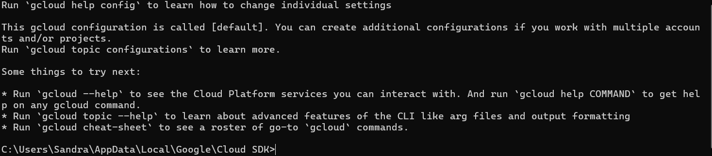
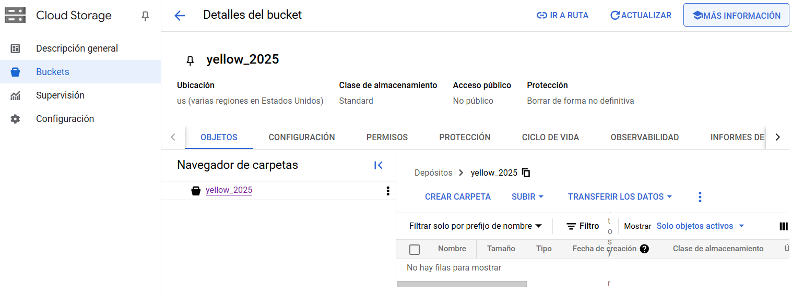
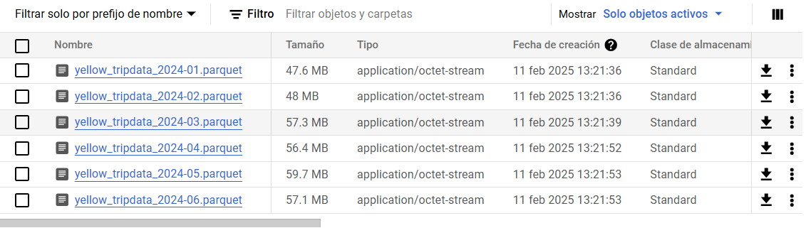
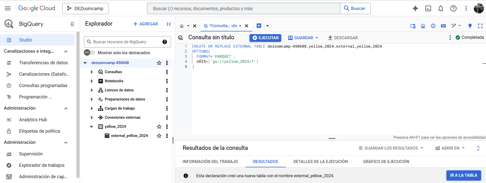
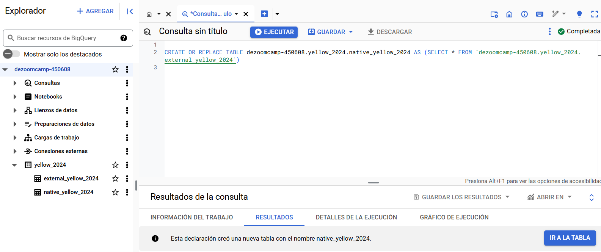
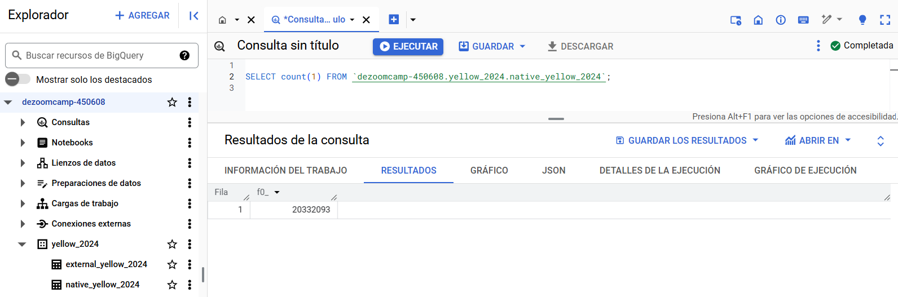
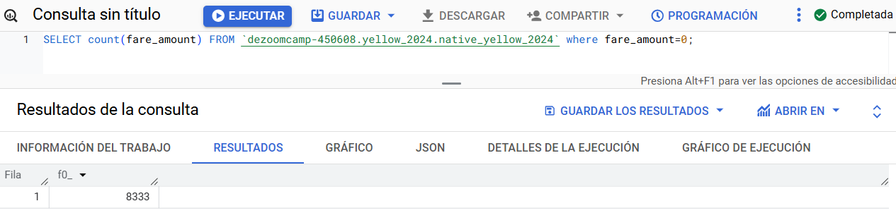
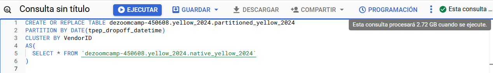
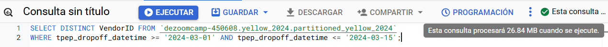

## Module 3 Homework

<b><u>Important Note:</b></u> 
 For this homework we will be using the Yellow Taxi Trip Records for **January 2024 - June 2024 NOT the entire year of data** 
Parquet Files from the New York City Taxi Data found here:   https://www.nyc.gov/site/tlc/about/tlc-trip-record-data.page  
If you are using orchestration such as Kestra, Mage, Airflow or Prefect etc. do not load the data into Big Query using the orchestrator.  
Stop with loading the files into a bucket.   

**Load Script:** You can manually download the parquet files and upload them to your GCS Bucket or you can use the linked script [here](./load_yellow_taxi_data.py): 
You will simply need to generate a Service Account with GCS Admin Priveleges or be authenticated with the Google SDK and update the bucket name in the script to the name of your bucket 
Nothing is fool proof so make sure that all 6 files show in your GCS Bucket before begining.  

<u>NOTE:</u> You will need to use the PARQUET option files when creating an External Table 

<b>BIG QUERY SETUP:</b> 
Create an external table using the Yellow Taxi Trip Records.  
Create a (regular/materialized) table in BQ using the Yellow Taxi Trip Records (do not partition or cluster this table).  

**Steps**
1. In the Google Cloud console, on the project selector page, select or create a Google Cloud project. Go to: https://console.cloud.google.com/projectselector2/home/dashboard?hl=es-419&pli=1&inv=1&invt=AbpRMw. After you finish these steps, you can delete the project, removing all resources associated with the project. Make sure that billing is enabled for your Google Cloud project.
2. Activate BigQuery in the new project (enable the AI Platform Training and Prediction API and Compute Engine APIs), go to Enable the BigQuery API: https://console.cloud.google.com/flows/enableapi?apiid=bigquery&hl=es-419 
3. Install Google Cloud CLI: https://cloud.google.com/sdk/install?hl=es-419
4. Initial Google Cloud with the command: `gcloud init`. Create and activate dezoomcamp-450608 project in Google Cloud Storage

5. List the credentials of Google Cloud with the command: `gcloud auth list`
6. List of properties of your configuration with the command: `gcloud config list`
7. Download file of January to Juny of yellow taxi from https://www.nyc.gov/site/tlc/about/tlc-trip-record-data.page.
8. Create a yellow_2024 bucket in Google Cloud Storage. Go to buckets and click in Create. 
9. Upload parquet files to the bucket yellow_2024.  
10. Create external table. Run this query in Big Query: `CREATE OR REPLACE EXTERNAL TABLE dezoomcamp-450608.yellow_2024.external_yellow_2024 OPTIONS(FORMAT='PARQUET', URIS=['gs://yellow_2024/*'])`. 
11. Create native table. Run this query in Big Query: `CREATE OR REPLACE TABLE dezoomcamp-450608.yellow_2024.native_yellow_2024 AS(SELECT * FROM 'dezoomcamp-450608.yellow_2024.external_yellow_2024')`. 

## Question 1:
Question 1: What is count of records for the 2024 Yellow Taxi Data?
- 65,623
- 840,402
- **20,332,093**
- 85,431,289

Query: SELECT count(1) FROM `dezoomcamp-450608.yellow_2024.native_yellow_2024`;

## Question 2:
Write a query to count the distinct number of PULocationIDs for the entire dataset on both the tables.  
What is the **estimated amount** of data that will be read when this query is executed on the External Table and the Table?

- 18.82 MB for the External Table and 47.60 MB for the Materialized Table
- **0 MB for the External Table and 155.12 MB for the Materialized Table**
- 2.14 GB for the External Table and 0MB for the Materialized Table
- 0 MB for the External Table and 0MB for the Materialized Table

Query 1: 
SELECT count(DISTINCT PULocationID) FROM `dezoomcamp-450608.yellow_2024.native_yellow_2024`;

Query 2: 
SELECT count(DISTINCT PULocationID) FROM `dezoomcamp-450608.yellow_2024.native_yellow_2024`;

## Question 3:
Write a query to retrieve the PULocationID from the table (not the external table) in BigQuery. Now write a query to retrieve the PULocationID and DOLocationID on the same table. Why are the estimated number of Bytes different?
- **BigQuery is a columnar database, and it only scans the specific columns requested in the query. Querying two columns (PULocationID, DOLocationID) requires reading more data than querying one column (PULocationID), leading to a higher estimated number of bytes processed.**
- BigQuery duplicates data across multiple storage partitions, so selecting two columns instead of one requires scanning the table twice, 
doubling the estimated bytes processed.
- BigQuery automatically caches the first queried column, so adding a second column increases processing time but does not affect the estimated bytes scanned.
- When selecting multiple columns, BigQuery performs an implicit join operation between them, increasing the estimated bytes processed

Query 3.1: SELECT PULocationID FROM `dezoomcamp-450608.yellow_2024.native_yellow_2024`;

Query 3.2: SELECT PULocationID, DOLocationID FROM `dezoomcamp-450608.yellow_2024.native_yellow_2024`;

## Question 4:
How many records have a fare_amount of 0?
- 128,210
- 546,578
- 20,188,016
- **8,333**

Query: SELECT count(fare_amount) FROM `dezoomcamp-450608.yellow_2024.native_yellow_2024` where fare_amount=0;

## Question 5:
What is the best strategy to make an optimized table in Big Query if your query will always filter based on tpep_dropoff_datetime and order the results by VendorID (Create a new table with this strategy)
- **Partition by tpep_dropoff_datetime and Cluster on VendorID**
- Cluster on by tpep_dropoff_datetime and Cluster on VendorID
- Cluster on tpep_dropoff_datetime Partition by VendorID
- Partition by tpep_dropoff_datetime and Partition by VendorID

Query: CREATE OR REPLACE TABLE dezoomcamp-450608.yellow_2024.partitioned_yellow_2024 PARTITION BY DATE(tpep_dropoff_datetime) CLUSTER BY VendorID AS (SELECT * FROM `dezoomcamp-450608.yellow_2024.native_yellow_2024`)

## Question 6:
Write a query to retrieve the distinct VendorIDs between tpep_dropoff_datetime
2024-03-01 and 2024-03-15 (inclusive) 

Use the materialized table you created earlier in your from clause and note the estimated bytes. Now change the table in the from clause to the partitioned table you created for question 5 and note the estimated bytes processed. What are these values?  

Choose the answer which most closely matches.  

- 12.47 MB for non-partitioned table and 326.42 MB for the partitioned table
- **310.24 MB for non-partitioned table and 26.84 MB for the partitioned table**
- 5.87 MB for non-partitioned table and 0 MB for the partitioned table
- 310.31 MB for non-partitioned table and 285.64 MB for the partitioned table

Query 1: SELECT DISTINCT VendorID FROM `dezoomcamp-450608.yellow_2024.native_yellow_2024` WHERE tpep_dropoff_datetime >= '2024-03-01' AND tpep_dropoff_datetime <= '2024-03-15';

Query 2: SELECT DISTINCT VendorID FROM `dezoomcamp-450608.yellow_2024.partitioned_yellow_2024` WHERE tpep_dropoff_datetime >= '2024-03-01' AND tpep_dropoff_datetime <= '2024-03-15';

## Question 7: 
Where is the data stored in the External Table you created?

- Big Query
- Container Registry
- **GCP Bucket**
- Big Table

## Question 8:
It is best practice in Big Query to always cluster your data:
- True
- **False**
