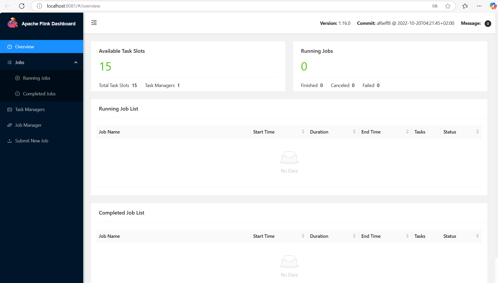
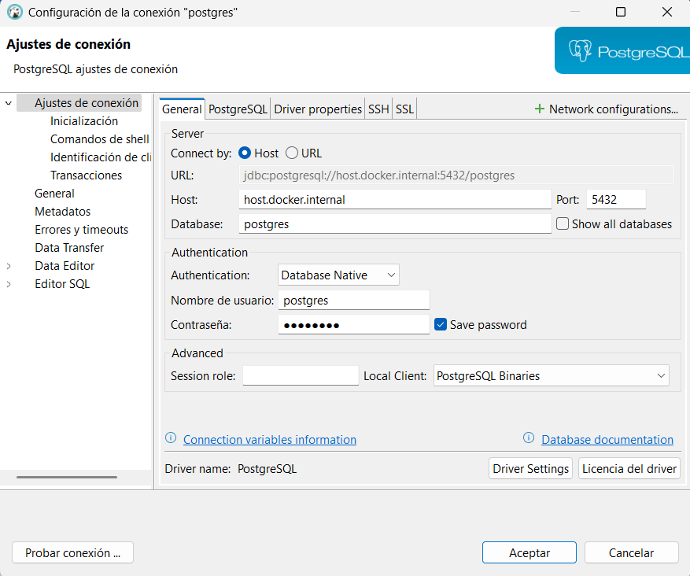

# Homework

In this homework, we're going to learn about streaming with PyFlink.

Instead of Kafka, we will use Red Panda, which is a drop-in
replacement for Kafka. It implements the same interface, 
so we can use the Kafka library for Python for communicating
with it, as well as use the Kafka connector in PyFlink.

For this homework we will be using the Taxi data:
- Green 2019-10 data from [here](https://github.com/DataTalksClub/nyc-tlc-data/releases/download/green/green_tripdata_2019-10.csv.gz)


## Setup

We need:

- Red Panda
- Flink Job Manager
- Flink Task Manager
- Postgres

It's the same setup as in the [pyflink module](../../../06-streaming/pyflink/), so go there and start docker-compose:

```bash
cd ../../../06-streaming/pyflink/
docker-compose up
```

(Add `-d` if you want to run in detached mode)

Visit http://localhost:8081 to see the Flink Job Manager

Connect to Postgres with pgcli, pg-admin, [DBeaver](https://dbeaver.io/) or any other tool.

The connection credentials are:

- Username `postgres`
- Password `postgres`
- Database `postgres`
- Host `localhost`
- Port `5432`

With pgcli, you'll need to run this to connect:

```bash
pgcli -h localhost -p 5432 -u postgres -d postgres
```

Run these query to create the Postgres landing zone for the first events and windows:

```sql 
CREATE TABLE processed_events (
    test_data INTEGER,
    event_timestamp TIMESTAMP
);

CREATE TABLE processed_events_aggregated (
    event_hour TIMESTAMP,
    test_data INTEGER,
    num_hits INTEGER 
);
```
**Steps:**

1) Open Docker
2) In Terminal of VSCode:
```bash
cd ../../../06-streaming/pyflink/
docker-compose up
```
3) Visit http://localhost:8081 to see the Flink Job Manager

4) En Terminal:
```bash
pgcli -h localhost -p 5432 -u postgres -d postgres
```
Password: postgres
5) Connect to [DBeaver](https://dbeaver.io/)
Under General give the Server a name: kestra taxi
Under Connection add:
- host name: host.docker.internal
- port:5432
- user:postgres
- password:postgres

6) Run these query to create the Postgres landing zone for the first events and windows:
```sql 
CREATE TABLE processed_events (
    test_data INTEGER,
    event_timestamp TIMESTAMP
);

CREATE TABLE processed_events_aggregated (
    event_hour TIMESTAMP,
    test_data INTEGER,
    num_hits INTEGER 
);
```

## Question 1: Redpanda version

Now let's find out the version of redpandas. 

For that, check the output of the command `rpk help` _inside the container_. The name of the container is `redpanda-1`.

Find out what you need to execute based on the `help` output.

What's the version, based on the output of the command you executed? (copy the entire version)

**Steps:**
1) In Terminal, access to the conteiner: 
```bash
docker exec -it redpanda-1 /bin/bash
```
2) Run the help of radpandas:
```bash
rpk help
```
3) Run the next command to know the version of radpandas:
```bash
rpk version
```
Version:     v24.2.18


## Question 2. Creating a topic

Before we can send data to the redpanda server, we
need to create a topic. We do it also with the `rpk`
command we used previously for figuring out the version of 
redpandas.

Read the output of `help` and based on it, create a topic with name `green-trips` 

What's the output of the command for creating a topic? Include the entire output in your answer.

Steps:
1) Create a topic named `green-trips`:
```bash
rpk topic create green-trips
```
2) Output:
TOPIC       STATUS
green-trips  OK


## Question 3. Connecting to the Kafka server

We need to make sure we can connect to the server, so
later we can send some data to its topics

First, let's install the kafka connector (up to you if you
want to have a separate virtual environment for that)

```bash
pip install kafka-python
```

You can start a jupyter notebook in your solution folder or
create a script

Let's try to connect to our server:

```python
import json

from kafka import KafkaProducer

def json_serializer(data):
    return json.dumps(data).encode('utf-8')

server = 'localhost:9092'

producer = KafkaProducer(
    bootstrap_servers=[server],
    value_serializer=json_serializer
)

producer.bootstrap_connected()
```

Provided that you can connect to the server, what's the output
of the last command?

Run connect_script.ipynb

Answer: True

## Question 4: Sending the Trip Data

Now we need to send the data to the `green-trips` topic

Read the data, and keep only these columns:

* `'lpep_pickup_datetime',`
* `'lpep_dropoff_datetime',`
* `'PULocationID',`
* `'DOLocationID',`
* `'passenger_count',`
* `'trip_distance',`
* `'tip_amount'`

Now send all the data using this code:

```python
producer.send(topic_name, value=message)
```

For each row (`message`) in the dataset. In this case, `message`
is a dictionary.

After sending all the messages, flush the data:

```python
producer.flush()
```

Use `from time import time` to see the total time 

```python
from time import time

t0 = time()

for index, row in df.iterrows():
    message = row.to_dict()
    producer.send(topic_name, value=message)

t1 = time()
took = t1 - t0
```

How much time did it take to send the entire dataset and flush? 

Answer: Time taken to send the dataset and flush: 36.465951442718506 seconds


## Question 5: Build a Sessionization Window (2 points)

Now we have the data in the Kafka stream. It's time to process it.

* Copy `aggregation_job.py` and rename it to `session_job.py`
cp aggregation_job.py session_job.py

* Have it read from `green-trips` fixing the schema
* Use a [session window](https://nightlies.apache.org/flink/flink-docs-master/docs/dev/datastream/operators/windows/) with a gap of 5 minutes
Use documentation of Apache Flink
* Use `lpep_dropoff_datetime` time as your watermark with a 5 second tolerance
Modify session_job.py
Run session_job.py

* Which pickup and drop off locations have the longest unbroken streak of taxi trips?


## Submitting the solutions

- Form for submitting: https://courses.datatalks.club/de-zoomcamp-2025/homework/hw6
- Deadline: See the website

