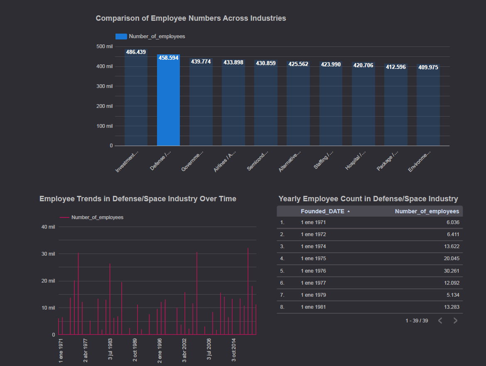

# Description of the problem
The goal of this project is to analyze historical data of organizations to identify trends and patterns across various industries. This will help companies and analysts make informed decisions based on past performance and organizational characteristics.

# Dataset
The dataset contains historical data of organizations, including information such as the organization's name, website, country, description, year of foundation, industry, and number of employees.

Link: https://drive.google.com/uc?id=13p-box0F9kou4wE9AyeBNKMSfE767xT-&export=download

# Development:

## Step 1: Configuración de la Infraestructura en la Nube (Google Cloud y Terraform)
1. Configurate your count of GCP
Create a count in Google Cloud Platform (GCP).
Configure a new project in GCP:
- Go to the GCP console.
- Create a new project.
- Note the ID Project.
- Go to GCP Service Account and click 'Create service account'. Name the service account, and click Create and continue.
- Select the roles for the service account. Choose BigQuery Admin and Storage Admin. Then, click Continue and Done.
- Access the created service and go to the Keys tab. Click Add Key and Create new key. Select JSON and Create. The JSON file will be downloaded (save the file in the project folder). This JSON file contains information about the GCP account and the service account. Do not share it with anyone.
2. Terraform Configuration:
- Install Terraform on your local machine.
- Configure Terraform to manage the infrastructure in GCP:
Create a main.tf file with the basic configuration for GCP.
Define the necessary resources, such as storage buckets and BigQuery.
Initialize Terraform: Run the following commands in your terminal:
```bash
terraform init
terraform plan
terraform apply
```
Verify in the GCP console that the storage bucket has been created correctly.

## Step 2: Orchestration using Kestra and Creation of a Data Ingestion Pipeline
1. Open Docker.
2. Create docker-compose.yml
3. Run the following command to start it:
`docker compose up -d`
4. Once the container starts, you can access the Kestra UI at http://localhost:8080. If it doesn't work, you should secure that all volumes is running in Docker (go to Docker app).
5. Later, you can access the pgAdmin UI at http://localhost:8090

## Step 3: Data Ingestion to the Data Lake
1. Create a workflow in Kestra
- Open the Kestra interface at http://localhost:8080.
- Define the workflows to upload to Kestra. See: gcp_kv.yml, gcp_setup.yml, and gcp_stock_pipeline.yml.
- Create the flows in Kestra and execute them in the following order:
1. Execute gcp_kv.
2. Execute gcp_setup
Nota: Note: If gcp_setup.yml fails due to the JSON file, resolve it by going to KVStore in Kestra, editing GCP_CREDS, and copying and pasting the entire content of the JSON file into Value. Then, re-execute the workflow.
3. Execute gcp_stock_pipeline. Enter the dataset link: https://drive.google.com/uc?id=13p-box0F9kou4wE9AyeBNKMSfE767xT-&export=download

## Step 4: Data Storage in the Data Warehouse
1. Load data into BigQuery
Once the gcp_stock_pipeline flow execution is complete, your BigQuery will have a set of tables within two main nodes (organizations_data and organizations_data_ext).

## Step 5: Change type of Founded column from INT to DATETIME
1. Acceder a BigQuery, e ir a la tabla con los datos.
2. Create a query with the following SQL command to add a new column Founded_DATE:
```bash
ALTER TABLE `ID-Project.project_zoomcamp.organizations_data` ADD COLUMN Founded_DATE DATE;
```
3. Then, update the new column Founded_DATETIME with the converted values from Founded:
```bash
UPDATE `ID-Project.project_zoomcamp.organizations_data`
SET Founded_DATE = DATE(Founded, 1, 1)
WHERE Founded IS NOT NULL;
```
4. Delete the original Founded column:
```bash
ALTER TABLE `ID-Project.project_zoomcamp.organizations_data` DROP COLUMN Founded;
```
5. Finally, rename Founded_DATETIME to Founded:
```bash
ALTER TABLE `ID-Project.project_zoomcamp.organizations_data` RENAME COLUMN Founded_DATE TO Founded;
```

## Step 6: Dashboard Construction
- Use Locker Studio to create a dashboard that visualizes the transformed data.
- Create graphs that show the distribution of categorical data and temporal data.

1. Create a new report:
- Click on "Start a new blank report".
- Click on "Connect to data" > "BigQuery".
- Select the project and all tables.
2. Connect to the Data Source
Select BigQuery:
Click on "Connect to data" and select "BigQuery".
Select your project, dataset, and the tables you have created (e.g., organizations_data).
3. Create Graphs
- Bar Chart:
Objective: Compare the number of employees across different industries.
Data: Use Industry and Number_of_employees.
Chart Type: Horizontal or vertical bars.
Configuration:
    X-axis: Industry
    Y-axis: Number_of_employees
- Time Series Chart:
Objective: Show the evolution of the number of employees over time.
Data: Use the Founded_DATE column for the time axis and Number_of_employees for the value.
Chart Type: Line or area.
Configuration:
    X-axis: Founded_DATE
    Y-axis: Number_of_employees
    Optional: Filter by Industry to see specific trends by sector.
4. Share the Dashboard
Save your dashboard.
Click on "Share" to generate a link that you can share with other users: https://lookerstudio.google.com/s/gVHRI2idiGM 
